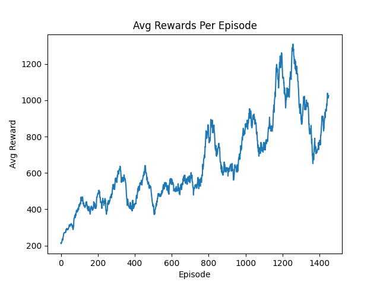

# Cart-Pole Deep Q-Network
Goal: Train a Deep Q-Network that can balance a Cart-Pole.

## Summary
This project focused on recreating the classic Cart-Pole problem and solving it using Reinforcement Learning.

To review, the Cart-Pole problem involves developing a solution to keep a pole upright while it is attached to a cart with wheels. This problem has already been solved using classical control theory, which typically approaches the problem by linearizing the system and applying linear control methods such as LQR to calculate the force required to keep the pole upright.

However, this problem can also be solved using Reinforcement Learning. In this approach, a neural network is trained to learn a policy that allows an agent to select the appropriate action based on the current state of the cart-pole system.

For this project, I introduced a few differences from the original problem. First, I attempted to solve the Cart-Pole problem using a **non-linearized system** and implemented a **4th-order Runge-Kutta numerical integrator** to propagate the system dynamics. Another difference from the classic problem was the use of a **larger action space** consisting of four different forces applied to the cart:
- Hard Left
- Soft Left
- Soft Right
- Hard Right

The classic problem only allows the cart to be pushed left or right with a constant force.

I still used the same observation space as the traditional problem: cart position, cart velocity, pole angle, and pole angular velocity. These values were used as inputs to the non-linear state-space differential equations that define the system dynamics.

Within this project, I developed a custom environment that inherits from the Gymnasium Environment class, allowing me to define the desired observation space and action space. Inside the environment, a step function takes the current state and selected action and uses the Runge-Kutta integrator to calculate the next state of the system. This information is then used by the reward function to help the agent learn.

Learning was performed using a three-layer neural network combined with Bellman’s equation to estimate Q-values. These Q-values represent the expected reward for taking a particular action in a given state.

At each step, the agent selects an action either through exploration (choosing a random action) or by using the learned policy produced by the neural network. Exploration is implemented using the epsilon-greedy technique, which allows the agent to try different actions while gradually improving its policy by learning better Q-values.

For this project, the parameters defined in the config_01.yml file were used to train the Cart-Pole model. Using a time step of 0.01 seconds and 1500 episodes, the agent achieved rewards as high as 1200. The plot below shows the moving average of the reward for each episode under this configuration.



To verify the model, an evaluation phase was performed using three different random seeds. The following metrics summarize the evaluation results:

```text
Episode: 1000
Timestep: 0.01
Model means: [1069.162, 1037.043, 1049.4295]
Model stds: [747.04, 729.04, 749.93]

Overall mean: 1051.88, Overall std: 13.23
```

As shown above, the model performed relatively well, consistently averaging above 1000. The standard deviation across episodes is fairly high, which may be the result of a few episodes ending early. Despite this variability, the overall performance indicates that the model is able to balance the pole reliably.

Overall, this is a solid first model that performs well and still has room for improvement through additional tuning and experimentation. For now, I am choosing to stop here because I am satisfied with the current state of the project. While there are several ways the model could be improved, I plan to move on to the next project and potentially return later to upgrade this RL Cart-Pole implementation.

## What I Learned

Through the creation of this project, I learned the following:
- How to set up non-linear state-space ordinary differential equations with Runge-Kutta numerical integration.
- How to create a custom reinforcement learning environment and agent.
- How to implement my own replay buffer using random.sample and deque.
- How an RL agent uses the epsilon-greedy technique along with Bellman’s equation to explore and improve its policy.
- The importance of updating the target network correctly to provide stability during training.
- How the size of the replay buffer affects the agent’s ability to sample diverse state-action experiences during learning.

## Future Work
- Add rendering to the Cart-Pole environment to visualize the animation.
- Create Docker containerization.
- Perform hyperparameter tuning to find the best configuration.
- Compare the trained policy against a baseline random policy.
- Improve visualization of training plots.
- Add logging for better experiment tracking.